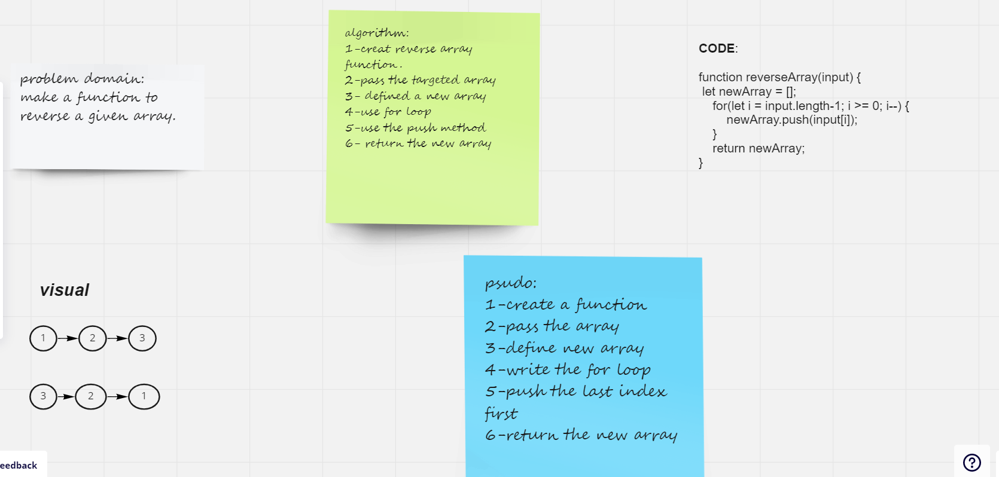

# Reverse an Array

Write a function called reverseArray which takes an array as an argument. Without utilizing any of the built-in methods available to your language, return an array with elements in reversed order.

## Whiteboard Process

## Approach & Efficiency

i used the for loop to reverse the given array then i used the push method in the new array because i started from the last elemnt.

BigO space/time:

time O(N)
space O(N)
