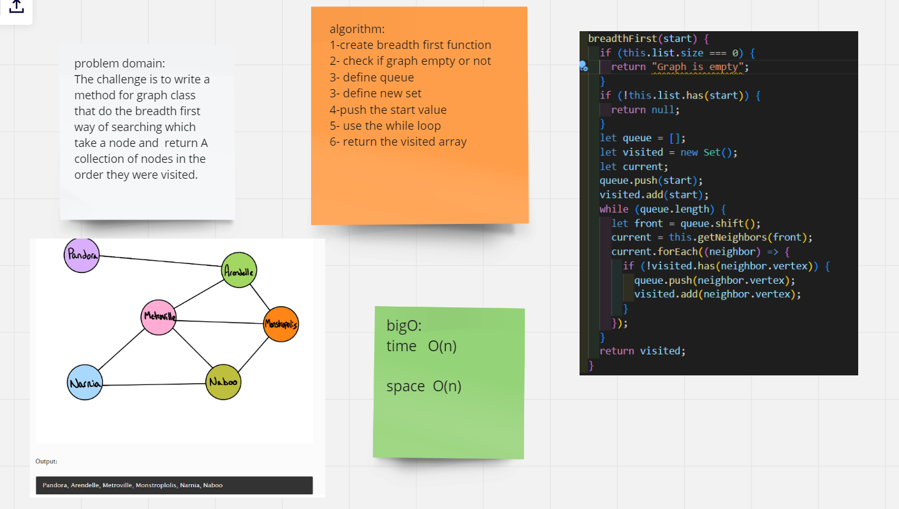

# Graphs

A graph is a non-linear data structure that can be looked at as a collection of vertices (or nodes) potentially connected by line segments named edges.

## Challenge

Implement your own Graph. The graph should be represented as an adjacency list, and should include the following methods:
1- add node  
Arguments: value  
Returns: The added node  
Add a node to the graph  
2- add edge  
Arguments: 2 nodes to be connected by the edge, weight (optional)  
Returns: nothing  
Adds a new edge between two nodes in the graph  
If specified, assign a weight to the edge  
Both nodes should already be in the Graph  
3-get nodes  
Arguments: none  
Returns all of the nodes in the graph as a collection (set, list, or similar)  
4-get neighbors  
Arguments: node  
Returns a collection of edges connected to the given node  
Include the weight of the connection in the returned collection  
5-size  
Arguments: none  
Returns the total number of nodes in the graph

## Approach & Efficiency

- add_node:no loops used in the solution and no extra space in the momery
  big o of time : o(1)  
  big o of space : o(1)
- add_edge:big o of time and space BigO(1)
- get_nodes: big o of time and space BigO(1)
- size:i big o of time and space BigO(1)

# breadth first

## Challenge Summary

The challange is to write a method for graph class that do the breadth first way of searching which take a node and return A collection of nodes in the order they were visited.

## Whiteboard Process

## Approach & Efficiency

i used a queue to check if the node visited.
i used while loop to keep track of the nodes that are visited.

big o of time : o(n) used while loop  
 big o of space : o(n) get extara space in the memory
