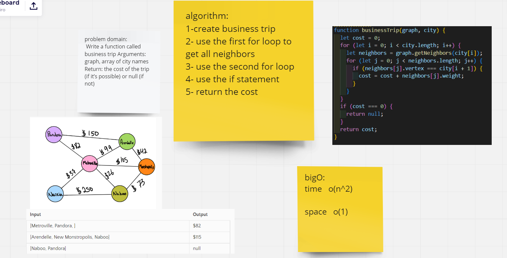

# Challenge Summary

Write a function called business tripArguments: graph, array of city names Return: the cost of the trip (if it’s possible) or null (if not)

## Whiteboard Process

## Approach & Efficiency

i used nested for loop in solving this problem
big o  
time : o(n^2)  
space : o(1)
