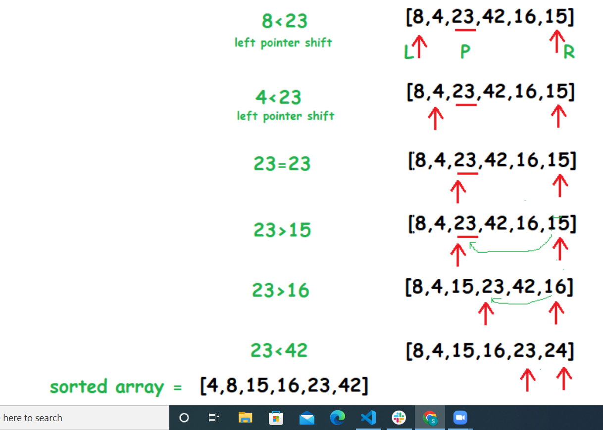

# Quick Sort

Quicksort is a divide-and-conquer algorithm. It works by selecting a 'pivot' element from the array and partitioning the other elements into two sub-arrays, according to whether they are less than or greater than the pivot. For this reason, it is sometimes called partition-exchange sort.[4] The sub-arrays are then sorted recursively. This can be done in-place, requiring small additional amounts of memory to perform the sorting.

# Pseudocode

ALGORITHM QuickSort(arr, left, right)
    if left < right
        // Partition the array by setting the position of the pivot value 
        DEFINE position <-- Partition(arr, left, right)
        // Sort the left
        QuickSort(arr, left, position - 1)
        // Sort the right
        QuickSort(arr, position + 1, right)

ALGORITHM Partition(arr, left, right)
    // set a pivot value as a point of reference
    DEFINE pivot <-- arr[right]
    // create a variable to track the largest index of numbers lower than the defined pivot
    DEFINE low <-- left - 1
    for i <- left to right do
        if arr[i] <= pivot
            low++
            Swap(arr, i, low)
    // place the value of the pivot location in the middle.
    // all numbers smaller than the pivot are on the left, larger on the right. 
     Swap(arr, right, low + 1)
    // return the pivot index point
     return low + 1

ALGORITHM Swap(arr, i, low)
    DEFINE temp;
    temp <-- arr[i]
    arr[i] <-- arr[low]
    arr[low] <-- temp

# Trace 

Sample array: [8,4,23,42,16,15]

STEP 1: let pivot as middle element (23) .

STEP 2: put left pointer on  first  element 8 and right pointer to last element 15 of the array.

STEP 3: Compare element at the left pointer with the pivot element. Since, 8 < 23 shift left pointer to the right to 4 .

STEP 4: 4 < 23 so shift left pointer to one more index to the right. So  23 = 23 stop incrementing the left pointer and now left pointer is at index 2.

STEP 5: Now, compare value at the right pointer with the pivot element. Since 15 < 23 stop moving the right pointer.

STEP 6: Swap both values at left and right pointers with each other and move both pointers one 

STEP 7: Since 16 < 23, Swap both values at left and right pointers with each other. move pointers to one more step .

# efficiency

Worst case : Time complexity O(n^2) / Space Complexity O(n)
Best case : Time complexity O(nlogn) / Space Complexity O(n)