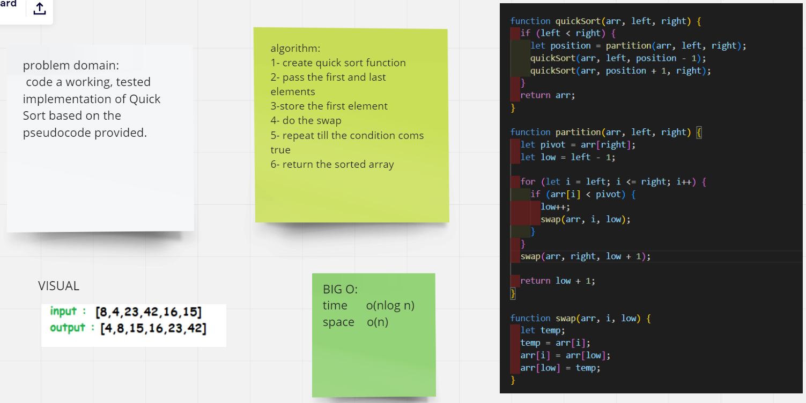

# Quick Sort

## Challenge

Review the pseudocode below, then trace the algorithm by stepping through the process with the provided sample array. Document your explanation by creating a blog article that shows the step-by-step output after each iteration through some sort of visual.

Once you are done with your article, code a working, tested implementation of Quick Sort based on the pseudocode provided.

## Approach & Efficiency

Big O: time: O(nLog n) / space: O(n) .
