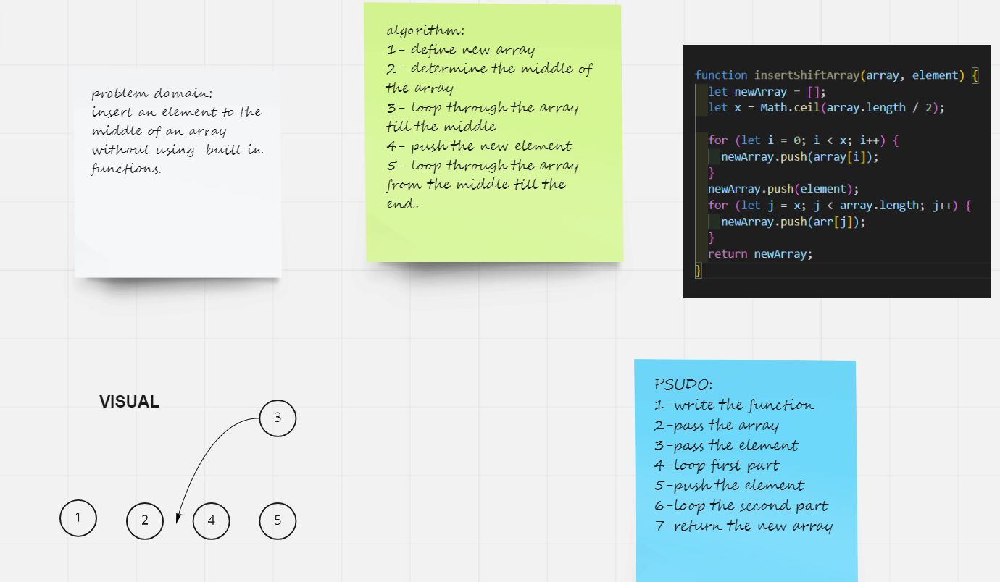

# Insert in the middle of array

Write a function called insertShiftArray which takes in an array and a value to be added. Without utilizing any of the built-in methods available to your language, return an array with the new value added at the middle index.

## Whiteboard Process

## Approach & Efficiency

i used the two loops to divide the array to two parts and push the element between this two loops .

i used math.ceil() to detrimine the middle point of the array and round it to the next integer .

i returend the new array after i pushed the rest of elements using the two loops.
