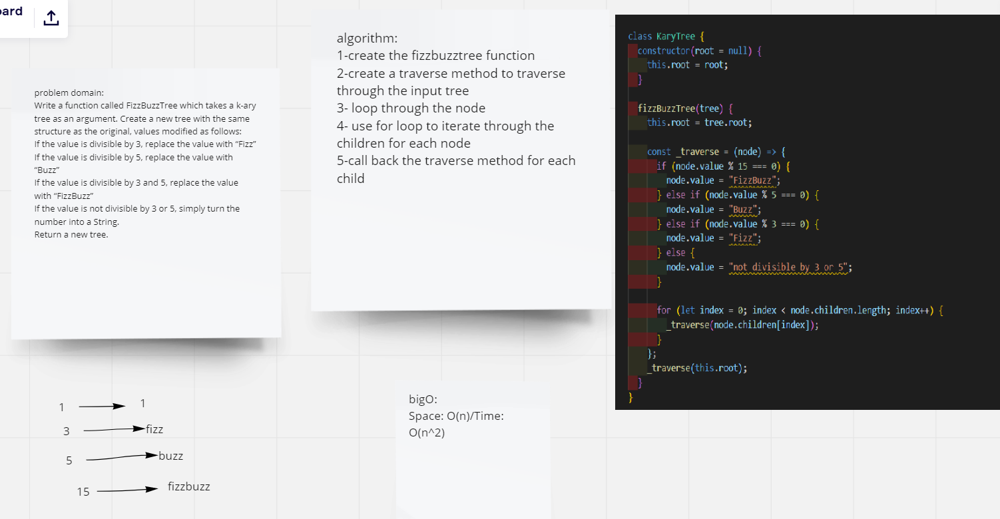

# Code Challenge: Class 18

Write a function called FizzBuzzTree which takes a k-ary tree as an argument. Create a new tree with the same structure as the original, values modified as follows:
If the value is divisible by 3, replace the value with “Fizz”
If the value is divisible by 5, replace the value with “Buzz”
If the value is divisible by 3 and 5, replace the value with “FizzBuzz”
If the value is not divisible by 3 or 5, simply turn the number into a String.
Return a new tree.

# Approach & Efficiency

Big O :Space: O(n)/Time: O(n^2)

