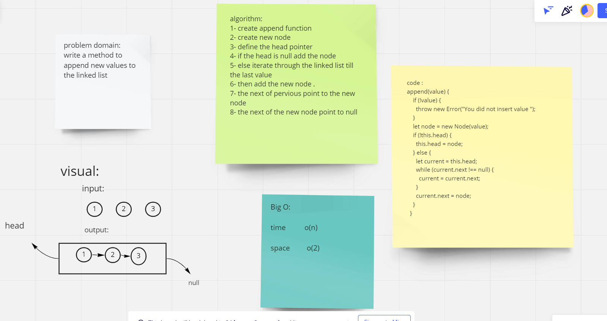
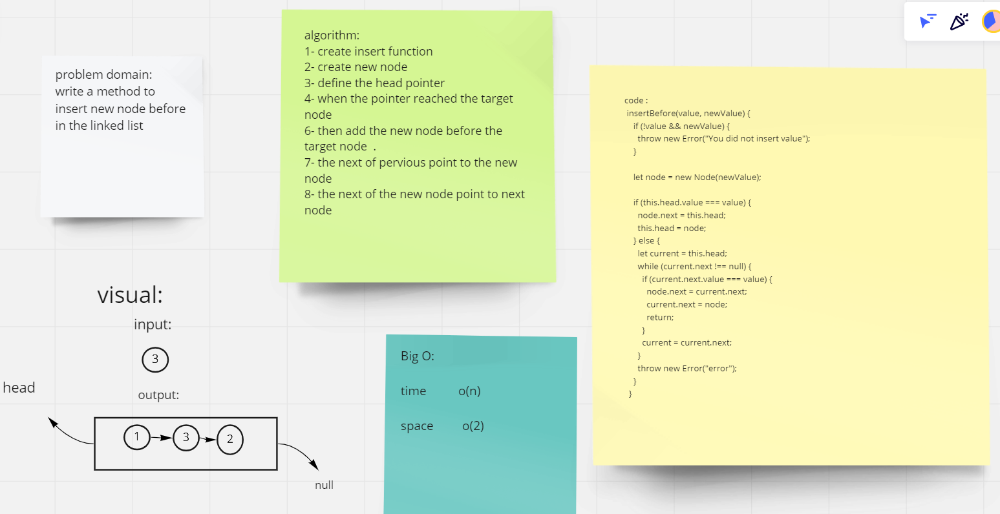
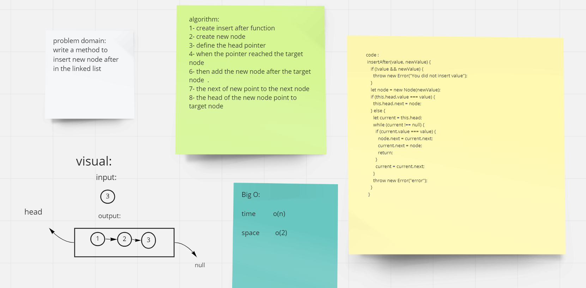
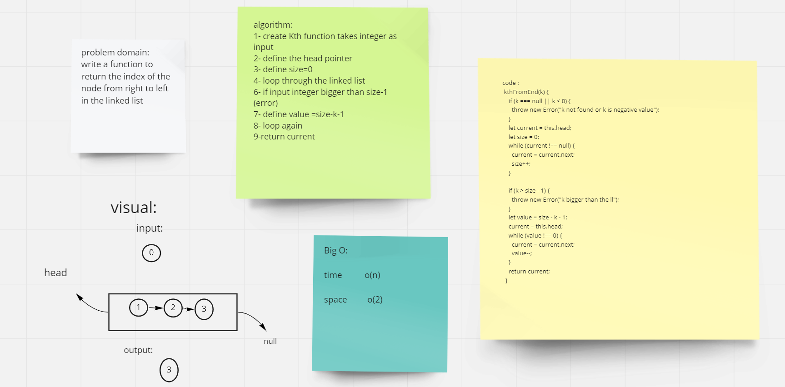

# Singly Linked List

A singly linked list is a type of linked list that is unidirectional, it can be traversed in only one direction from head to the last node (tail).
A single node contains data and a pointer to the next node which helps in maintaining the structure of the list.

## Challenge

Create a Node class that has properties for the value stored in the Node, and a pointer to the next Node.
Within your LinkedList class, include a head property. Upon instantiation, an empty Linked List should be created.

## Whiteboard Process

## Approach & Efficiency

useing while loop because loop does't have starting and ending values so it will be flixable with the condition untill the condition is false.
BigO O(1).

## API

- Method `insert` takes any value as an argument and adds a new node with that value to the head of the list with an O(1) Time performance.
- Method `includes` takes any value as an argument and returns a boolean result depending on whether that value exists as a Node’s value somewhere within the list.
- Method `toString` takes in no arguments and returns a string representing all the values in the Linked List, formatted as: 
  `"{ a } -> { b } -> { c } -> NULL"`
- `.append(value)` adds a new node with the given value to the end of the list.
- `.insertBefore(value, newVal)` add a new node with the given newValue immediately before the first value node.
- `.insertAfter(value, newVal)` add a new node with the given newValue immediately after the first value node.
- kthFromEnd function return the index of the node from right to left in the linked list.
