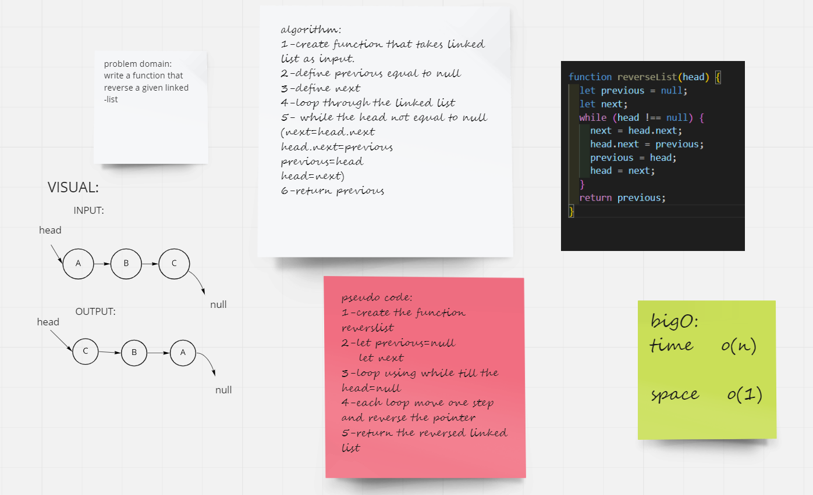
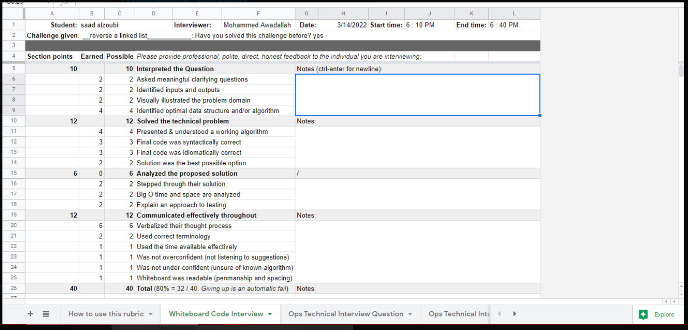

# Reverse linked list

write a function that reverse a given linked list

# Whiteboard Process

# Approach & Efficiency

i used the while loop to reverse the linked list

bigO:
time ------> o(n)
space ------> o(1)
