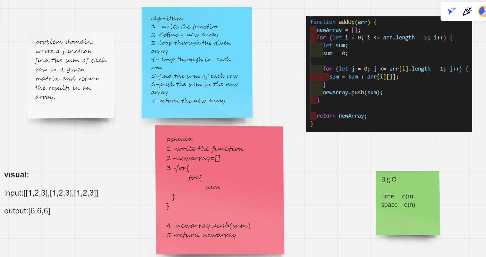

# Find the row sum

write a function find the sum of each row in a given matrix and return the results in an array.

# Whiteboard Process

# Approach & Efficiency

i used the two nested loops to find the sum of each row in the given matrix .

i used .push() to push each row sum inside the new array .

i returend the new array.
