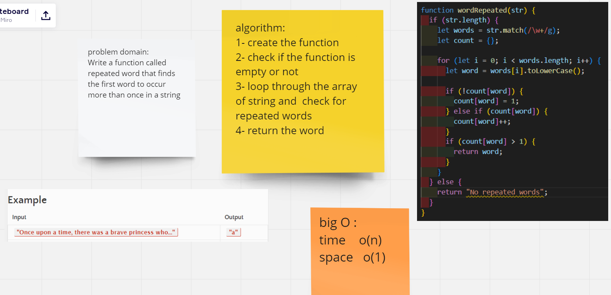

# Challenge Summary

Find the first repeated word in a book.

# Challenge Description

Write a function called repeated word that finds the first word to occur more than once in a string
Arguments: string
Return: string

# Approach & Efficiency

repeatedWord: Time O(n) / Space O(1)

