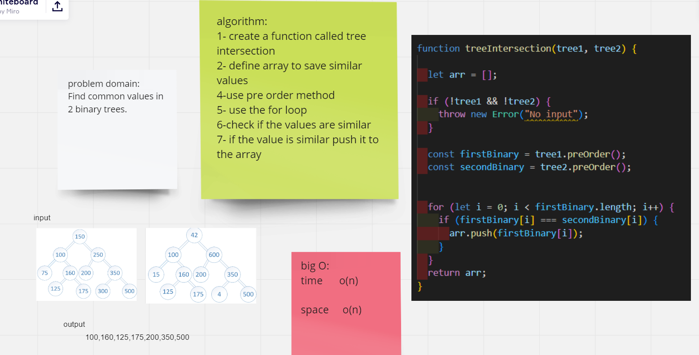

# tree-intersection

## Challenge

Find all values found to be in 2 binary trees by writing a function called tree intersection with arguments: two binary trees,and return an array

## Approach & Efficiency

using the for loop to find similar values

Time O(n)/space O(n)

### pull request URL:

https://github.com/saadomaralzoubi/data-structures-and-algorithms/pull/41
