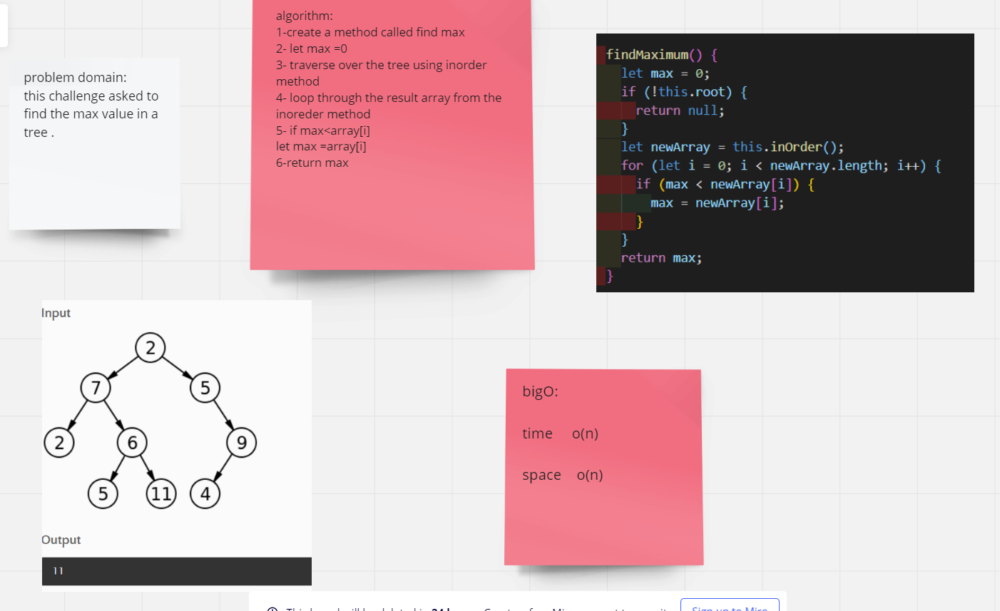
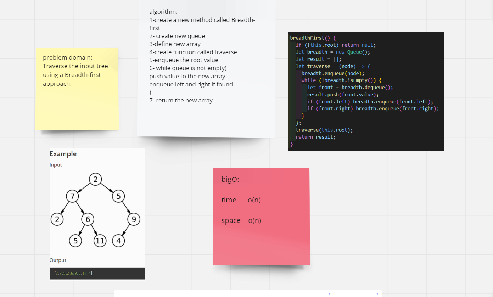

# Trees

A tree is a type of data structure representing hierarchical data. It has a non-linear structure consisting of nodes connected by edges.

## Challenge

The challenge asked to create a binary tree class has preorder inOrder and postorder travers methods and binary search trees which is a sub-class of the binary tree class with two newer methods ( add , contains)

## Approach & Efficiency

- preOrder ---> BigO o(n^2)
- inOrder ---> BigO o(n^2)
- postOrder ---> BigO o(n^2)
- findmax ---> BigO o(n).
- breadth-first ---> BigO o(n).

# whiteBoard

